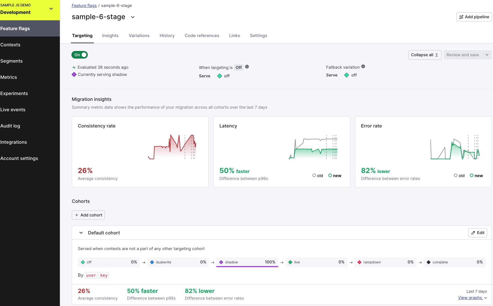
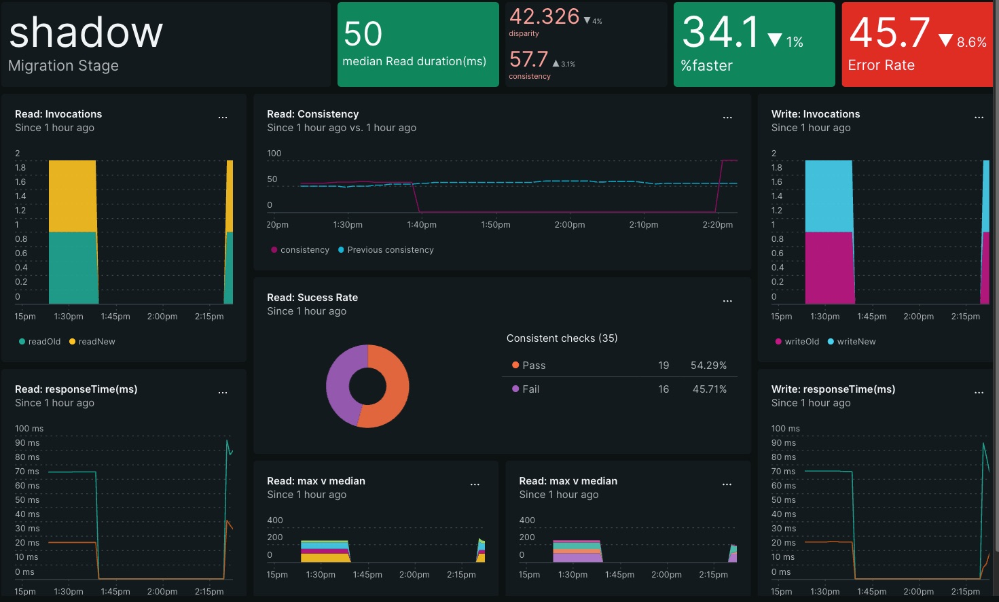

# LaunchDarkly Migration Assistant with OpenTelemetry
This project demonstrates how to use OpenTelemetry with LaunchDarkly migration flags to track the progress of a migration using manual instrumentation. It generates requests to showcase the integration and provides insights into the migration process.


*LaunchDarkly Migration Insights dashboard*



*NewRelic Dashboard*
## Features

Automatically tracks consistency rate, latency, and error rate for migration flags
Integrates with OpenTelemetry to export telemetry data
Supports multiple exporters, including Prometheus and New Relic
Provides a sample configuration for easy setup and customization

## Prerequisites
* NodeJS >=v16
* LaunchDarkly account
* New Relic account (optional)
* Prometheus

## Installation
1. Clone the repository:
```
git clone git@github.com:tanben/sample-ld-migration.git
```

2. Install the dependencies:
```
npm install
```

3. Copy the `.env.example` file to `.env` and update it with your LaunchDarkly SDK key (server-side) and New Relic ingest key.

## Configuration
The project uses a configuration file (.env) to customize various settings. Here's an example configuration:

```
# Application config
POLL_INTERVAL=60000
RANDOMIZE_READ=false
RANDOMIZE_WRITE=false

# LaunchDarkly config
LD_SDK_KEY=sdk-11111111-2222222-333333
LD_FLAG_KEY="sample-6-stage-flag"

# OpenTelemetry config
OTEL_ENABLED=false
EXPORTER_INTERVAL=60000
OTEL_DEBUG=false
OTEL_SERVICE_NAME="sample-migration"
OTEL_CONSOLE_LOG=false
OTEL_PROVIDERS=prometheus
# OTEL_PROVIDERS=newrelic,prometheus

# OpenTelemetry Provider config
NEW_RELIC_LICENSE_INGEST_KEY=aaaaa-bbbbbbbbb-cccccccc
OTEL_EXPORTER_OTLP_ENDPOINT=https://otlp.nr-data.net:4318

```

## Usage
To run the project, use the following command:
```
npm run migration
```
or
```
node poll.js
```

The project will start generating requests and exporting telemetry data based on the configured settings.
### Exported Telemetry Data
#### Metrics
* `migration.read`
* `migration.write`
* `migration.summary.consistent`
* `migration.summary.read`
* `migration.summary.write`

#### Counters
* `operation`: readNew, readOld, writeNew, writeOld
* `executionTime`: Execution time in milliseconds
* `stage`: off, dualwrite, shadow, rampdown, complete (see multi-stage migrations for details)


### Sample Output
```

Running [1] Wed Dec 13 2023 14:20:09 GMT-0500 (Eastern Standard Time)
1702495209743: Stage[shadow] Operation[writeOld] user[Everett Gibson]
1702495209745: Stage[shadow] Operation[readOld] user[Everett Gibson]
1702495209753: Stage[shadow] Operation[writeNew] user[Everett Gibson]
1702495209755: => migration:write() Complete. result={"authoritative":{"origin":"old","success":true,"result":{"success":true,"value":"goodbye","executionTime":95,"operation":"writeOld","stage":"shadow"}},"nonAuthoritative":{"origin":"new","success":true,"result":{"success":true,"value":"goodbye","executionTime":8,"operation":"writeNew","stage":"shadow"}}}
1702495209787: Stage[shadow] Operation[readNew] user[Everett Gibson]
1702495209788: => Check: Read consistency validation. 
oldVal={"success":true,"value":"goodbye","executionTime":97,"operation":"readOld","stage":"shadow"}
newVal={"success":true,"value":"goodbye","executionTime":41,"operation":"readNew","stage":"shadow"}
1702495209788: => Check: Read consistency  Timediff= 56 oldVal=goodbye newVal=goodbye Status[Pass]
1702495209789: => migration:read() Complete. result={"origin":"old","success":true,"result":{"success":true,"value":"goodbye","executionTime":97,"operation":"readOld","stage":"shadow"}}
```


## Resources
* [OpenTelemetry Metrics SdK](https://www.npmjs.com/package/@opentelemetry/sdk-metrics)
* [Prometheus Example](https://github.com/open-telemetry/opentelemetry-js/tree/main/experimental/examples/prometheus)
* [NewRelic Examples](https://github.com/newrelic/newrelic-opentelemetry-examples?tab=readme-ov-file)
  